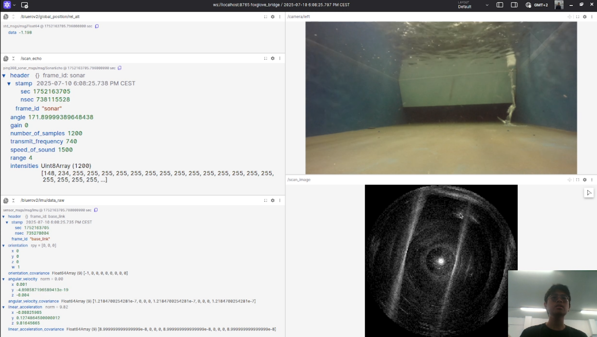

---

# Ping360 Package Collection

This directory contains a collection of interrelated ROS 2 packages designed for working with the **Ping360 imaging sonar**. This has been the core focus of my internship — learning how to operate, integrate, and experiment with this sensor.

---

### 📌 Sensor Information

* **Sensor Used**: [Blue Robotics Ping360 Sonar](https://bluerobotics.com/store/sonars/imaging-sonars/ping360-sonar-r1-rp/)
* **Official Documentation**: [Ping360 Documentation](https://bluerobotics.com/store/sonars/imaging-sonars/ping360-sonar-r1-rp/)

---

### 🙏 Acknowledgements

Special thanks to [Centrale Nantes Robotics](https://github.com/CentraleNantesRobotics/ping360_sonar/) for their excellent open-source implementation, which this package builds upon.

---

### 📦 Included Packages

* **`ping360_sonar`** – Main package containing the ROS 2 node implementation for the sonar.
* **`ping360_sonar_msgs`** – Custom message definitions used by the `ping360_sonar` package.
* **`ping_sonar_ros-master`** – Prerequisite package from the MIR program, required only during installation.

---

### 🧪 Project Scope

This package suite is built for deployment on a **BlueROV2 Heavy Configuration**. Testing and development were conducted in a **controlled water tank environment**, focusing on evaluating the sonar’s performance under different scenarios and code configurations.

---

### ✅ Recommended Tools

To enhance visualization and ease of interaction, the following tools are highly recommended:

* **`rqt`** – A modular ROS GUI for debugging and visualization.
* **`Foxglove Studio`** – A modern ROS visualization tool, especially useful for viewing sonar data in real-time.

---

## 🚀 Getting Started

### Step 1: Setup

Clone or move all the included packages into your ROS 2 workspace (e.g., `src/` directory), then build and source:

```bash
colcon build
source install/setup.bash
```

---

### Step 2: First-Time Run Instructions

Before launching the node, make sure the Ping360 sensor is properly connected and recognized by the BlueROV:

1. Open your browser and go to your BlueROV’s configuration page:
   `http://192.168.2.2/` *(or whichever IP your BlueROV is configured to)*
2. Navigate to the **Ping360** tab and confirm the sensor is detected and active.

Once confirmed, you can launch the main ROS 2 node with:

```bash
ros2 run ping360_sonar ping360.py
```

once ran, you can see three topics

1. /scan (you can ignore this one) | message used :sensor_msgs/msg/LaserScan
2. /scan_echo : this is where all the data lives : ping360_sonar_msgs/msg/SonarEcho
3. /scan_image : the image of the scan sonar : sensor_msgs/msg/Image


You can add that section like this, using a placeholder for the image path so it’s easy to update later:

---

### Visual Output in Foxglove

Once everything is running, you can visualize the sonar data in **Foxglove Studio**. This provides a clean, real-time interface for inspecting the Ping360 output.

Here’s an example of what the sonar data looks like:


To include this in your Markdown file for GitHub or any static viewer:

```md

```

Let me know if you want help adding image publishing code so the raw data can be visualized more intuitively in Foxglove (e.g., converting sonar readings into a pointcloud or radar-like display).
