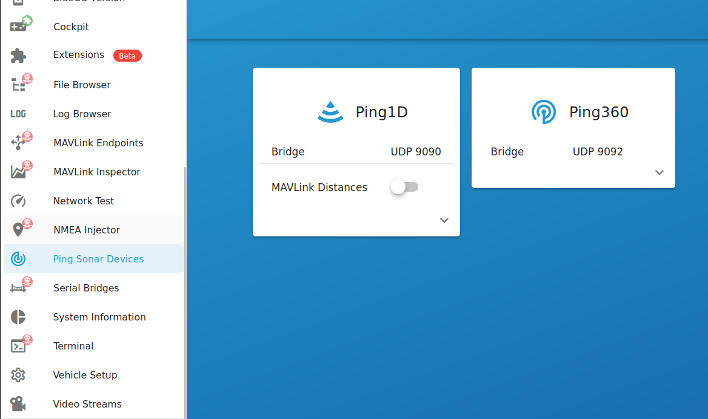
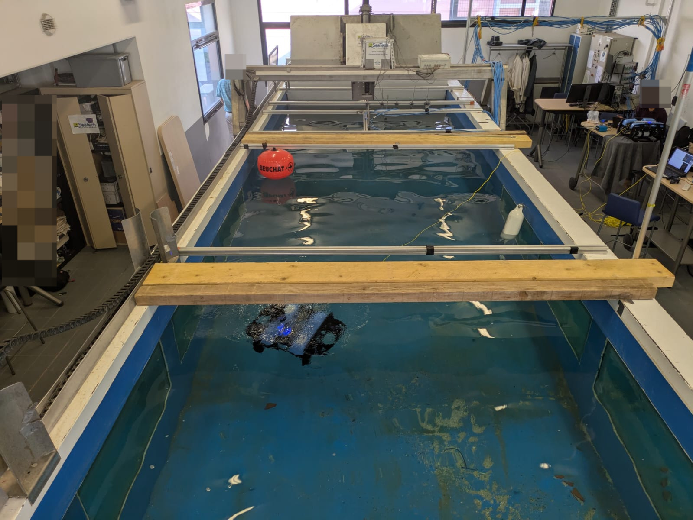
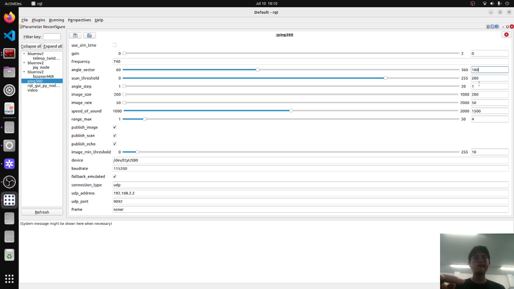
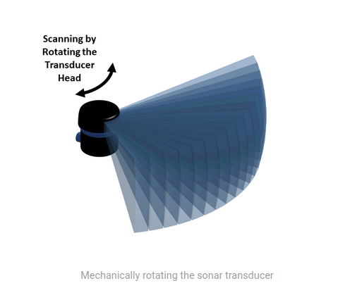
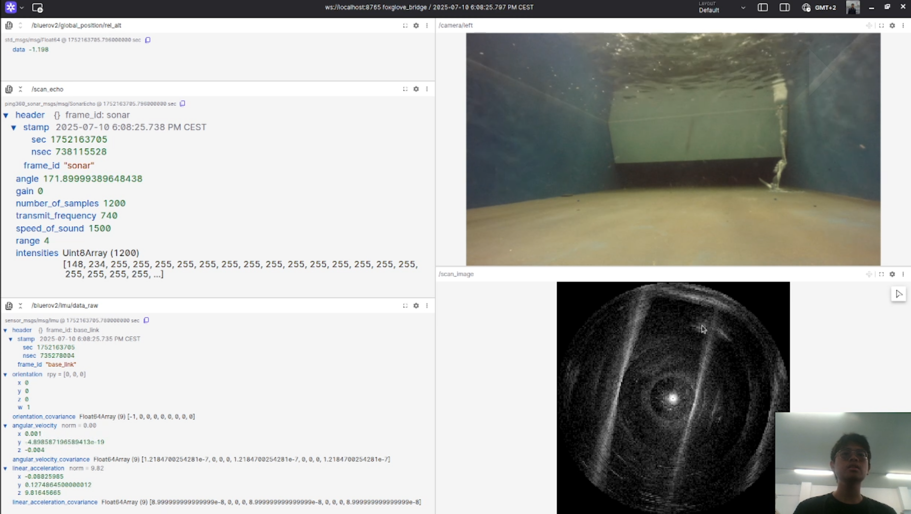
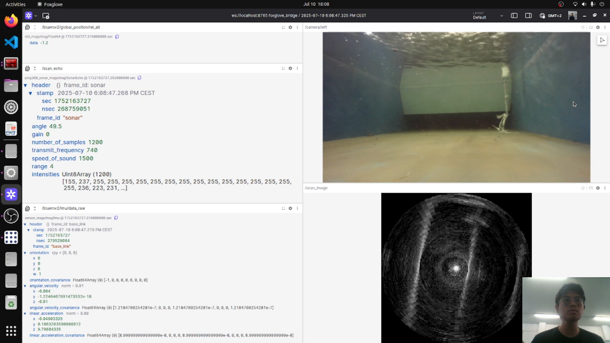
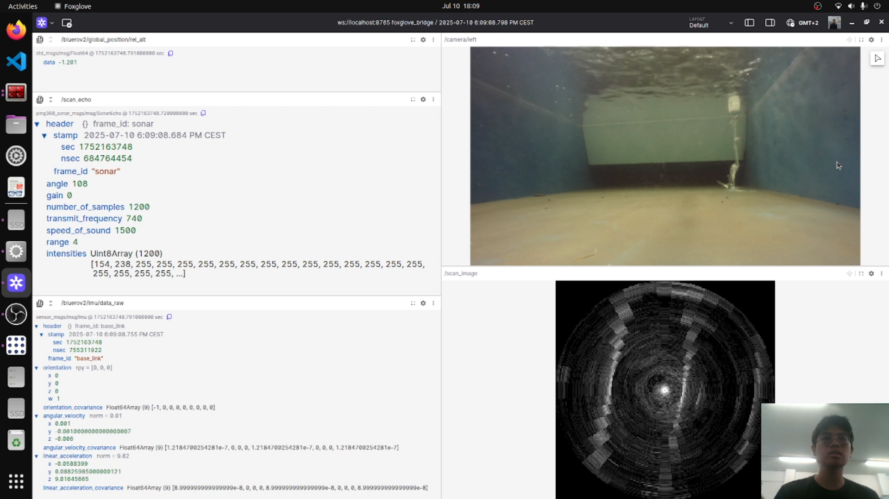
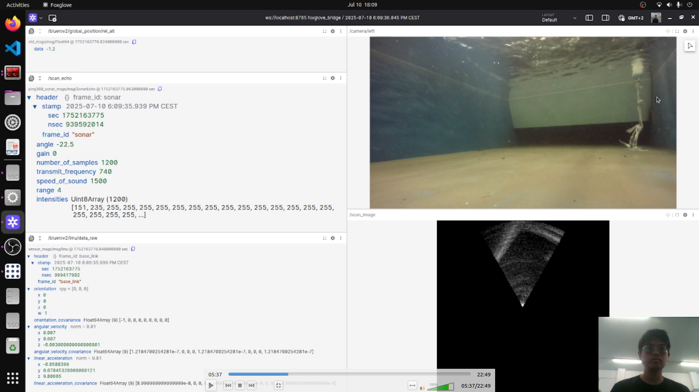
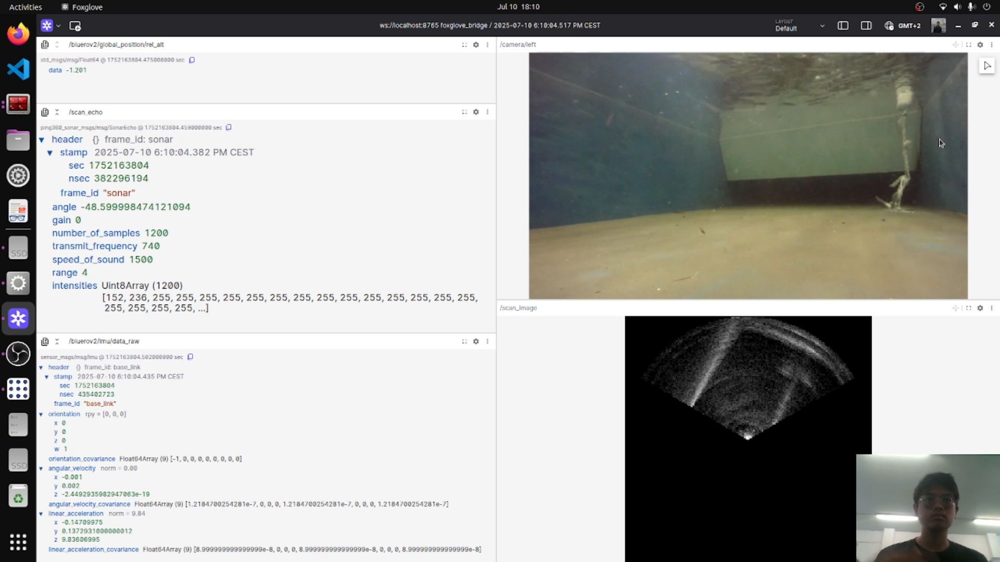

---

# Ping360 Package Collection

This directory contains a set of ROS 2 packages for working with the **Ping360 imaging sonar**. This project has been the main focus of my internship, where I explored how to operate and integrate this sensor in real-world scenarios.

### Sensor Information

* **Device**: [Blue Robotics Ping360 Sonar](https://bluerobotics.com/store/sonars/imaging-sonars/ping360-sonar-r1-rp/)
* **Documentation**: [Official Product Page](https://bluerobotics.com/store/sonars/imaging-sonars/ping360-sonar-r1-rp/)

### Acknowledgements

Based on the work by [Centrale Nantes Robotics](https://github.com/CentraleNantesRobotics/ping360_sonar/), which provided the core codebase for the sonar interface.

### Included Packages

* `ping360_sonar`: Main ROS 2 node for Ping360
* `ping360_sonar_msgs`: Custom message definitions used by the node
* `ping_sonar_ros-master`: Prerequisite utility package from the MIR program

### Project Overview

These packages are tested with a **BlueROV2 Heavy Configuration**, particularly in a controlled water tank environment. The goal is to evaluate how the Ping360 performs under different conditions and explore various configuration strategies.

### Recommended Tools

* `rqt`: For easy GUI-based ROS visualization
* `Foxglove Studio`: For a cleaner and more modern view of sonar data

---

## Getting Started

### 0. Library Dependencies

Before running the package, make sure the following libraries are installed to avoid import and runtime errors:

1. **[Ping Python Library (BlueRobotics fork)](https://github.com/bluerobotics/ping-python)**
   Required for Python-based interaction with the Ping sonar device. Install this first for proper functionality of the Python scripts.

2. **[Ping C++ Node (Submodule)](https://github.com/GSO-soslab/ping-cpp?tab=readme-ov-file)**
   This C++ version of the Ping interface is available as a submodule. *(Note: This project primarily uses the Python implementation.)*

3. **[ROS `image_transport`](http://wiki.ros.org/image_transport)**
   Required for handling image topics in the C++ node. Ensure this package is installed if you're using the C++ interface.


### 1. Setup

Place all the listed packages into your ROS 2 workspace (`src` folder), then build and source:

```bash
colcon build
source install/setup.bash
```

### 2. First-Time Run

Before running the node, check that the sensor is properly connected:

1. Open your BlueROV’s web interface: `http://192.168.2.2/` (or your specific IP)
2. Go to the **Ping360** tab and ensure the sensor is detected and responsive



if everything is in order, you can ran the code with following command, make sure everything has been built and sourced properly.


You can run the code with the following code
```bash
ros2 run ping360_sonar ping360.py
```

---

### ROS 2 Topics

Once the node is running, you’ll see the following topics:

1. **`/scan`** – Can be ignored; publishes empty or unused data
   • Message type: `sensor_msgs/msg/LaserScan`

2. **`/scan_echo`** – Main data stream containing raw sonar echo information
   • Message type: `ping360_sonar_msgs/msg/SonarEcho`

3. **`/scan_image`** – Visualization of the sonar scan as an image
   • Message type: `sensor_msgs/msg/Image`

> You can use tools like `rqt`, `ros2 topic echo`, or **Foxglove Studio** to visualize these topics in real-time.


You can add that section like this, using a placeholder for the image path so it’s easy to update later:

---

### Visual Output in Foxglove

Once everything is running, you can visualize the sonar data in **Foxglove Studio**. This provides a clean, real-time interface for inspecting the Ping360 output.

Here’s an example of what the sonar data looks like:


# A Deeper Dive
You can use the **RQT user interface** to modify various parameters of the Ping360 sonar during runtime. However, if you want to set **default parameters**, you’ll need to modify the source code directly.

Open the file `ping360.py` located inside the `ping360_sonar` package under the `src` folder. Focus on the section where the default parameters are defined:

```python
parameters = {
    'gain': [0, 0, 2],
    'frequency': 740,
    'angle_sector': [360, 60, 360],
    'scan_threshold': [200, 0, 255],
    'angle_step': [1, 1, 20],
    'image_size': [200, 200, 1000],
    'image_rate': [50, 50, 2000],
    'speed_of_sound': [1500, 1000, 2000],
    'range_max': [6, 1, 50],
    'publish_image': True,
    'publish_scan': True,
    'publish_echo': True,
    'image_min_threshold': [10, 0, 255],
}
```
## ⚙️ Parameter Descriptions

### 1. `gain`

* Controls the **intensity (sensitivity)** of the sonar.
* A higher value makes the sonar more sensitive but may also increase noise.

### 2. `frequency`

* The **base frequency** of the sonar in kHz.
* Usually left at the default value unless fine-tuning for a specific environment.

### 3. `angle_sector`

* Defines the **scanning angle range**.
* The sonar rotates using a stepper motor, so you can limit the scan to a forward-facing arc (e.g., 60° to 360°).

### 4. `scan_threshold`

* Sets the minimum signal strength (echo intensity) required for a point to be considered valid.
* Possibly sets a threshold for valid return signals; needs confirmation.

### 5. `angle_step`

* Defines the **angular resolution** of the scan.
* Smaller steps → higher resolution but slower scan.
* Larger steps → faster scan but lower detail.

### 6. `image_size`

* defines the pixel resolution or dimensions of the sonar image.

### 7. `image_rate`

* controls how frequently images are generated or updated.
* Higher rate → more frequent updates, but increased CPU/network usage

### 8. `speed_of_sound`

* Critical for accurate range measurements.
* Refer to environmental documentation: **salinity, temperature, and pressure** significantly affect this value.

### 9. `range_max`

* Sets the **maximum detection range** of the sonar in meters.
* Adjust based on your operational needs (e.g., `6`, `10`, or `20` meters).

### 10. `publish_*` flags (`image`, `scan`, `echo`)

* Enable or disable publishing of sonar data on ROS topics.
* Useful for reducing network load or debugging specific outputs.

### 11. `image_min_threshold`

* A custom filtering parameter to **remove low-intensity noise** from images.
* Values below this threshold are blacked out, helping to visually isolate relevant objects.

## 📌 Notes

* Values can be adjusted through **RQT** during runtime.
* If you're unsure about a parameter (e.g., `scan_threshold`, `image_size`, `image_rate`), it's best to consult the **Ping360 BlueRobotics Documentation** or experiment incrementally.
* Visualization samples and performance comparisons (e.g., angle step effects) can be added below.

Sure! Here's the content rewritten as a polished `README.md` section for including the rosbag replay instructions:

---

# 🎞️ Offline Data Replay with ROS Bag

If you want to **replay the sonar data locally** without connecting to the actual robot, you can use the pre-recorded **ROS bag** file provided below.

You can download the bag file from this Google Drive folder:

👉 [ROS Bag Link](https://drive.google.com/drive/folders/1jmrwAuXjsGBp1a2yrn4YiLzvOXilutw_?usp=drive_link)

---
Here’s a professional, clear, and well-structured rewrite of your **Results** section, preserving your voice but improving readability, grammar, and technical tone:

---

## Results

Let’s dive into the testing phase. All experiments were conducted in a controlled environment — specifically, the water tank at the University of Toulon, as shown below:



Note: The tank was shared with a colleague who had deployed a buoy for their own experiments. As a result, some of their equipment appears in the BlueROV’s camera feed and sonar scans.

The goal of these experiments was to observe how the scanning sonar (Ping360) responds to parameter tweaks in real-time. To facilitate tuning, I used **RQT**, a ROS visualization tool. If you have ROS installed, you can launch RQT with the following command:

```bash
rqt
```

Once launched, you’ll see a window like this:



---

## 1. `angle_step` Parameter

One of the key parameters affecting sonar performance is `angle_step`. This defines the angular increment of the stepper motor as it rotates the sonar head. A smaller step results in higher resolution (slower scan), while a larger step yields faster but lower-resolution scans.

Refer to this illustration from the [BlueRobotics website](https://bluerobotics.com/learn/understanding-and-using-scanning-sonars/) for a better understanding:



In the code, the parameter is defined as follows:

```python
parameters = {
    ...
    'angle_step': [1, 1, 20],
    ...
}
```

Below are results from varying the `angle_step` value and their impact on sonar performance:

---

### 1.1 `angle_step = 1` (Default)

This is the default setting, resulting in the **slowest and most detailed** scan.



**Discussion:**
The sonar returns a high-resolution scan of the pool environment, clearly capturing both the walls and foreign objects. As seen in the camera feed, there's an object directly in front of the BlueROV. This object is also distinctly visible in the sonar image as a bright reflection, accurately corresponding to its position relative to the vehicle.

---

### 1.2 `angle_step = 5`

Next, I increased the step size to 5.



**Discussion:**
The overall scene remains recognizable, but resolution has noticeably degraded. Pixelation and noise are more apparent. However, the scan speed improves significantly. This suggests that `angle_step = 5` might be a good compromise for tasks like **real-time collision avoidance**, where speed is more critical than fine detail.

---

### 1.3 `angle_step = 10`

Finally, I tested with `angle_step = 10`.



**Discussion:**
The sonar scan becomes very coarse at this setting. While major structures (like pool walls) remain detectable, small objects are hard to distinguish. Despite the significant loss in detail, the faster scan time shows potential for **high-speed navigation or rapid situational awareness**, provided that low resolution is acceptable.

---

## 2. `angle_sector` Parameter

The `angle_sector` parameter defines the angular coverage of the sonar scan — essentially, how wide of an area the sensor should sweep. This is particularly useful when you're only interested in scanning a specific region in front of your ROV.

**Important Note:**
During my experiments, I was able to successfully change the *scope* of the angle (i.e., how wide the scan is), but I was **not** able to change the *origin* of the scanning sector — meaning the scan always remained centered in **front** of the pinger. If your pinger is properly installed, this corresponds to the front-facing direction of your robot.

In the code, the parameter is defined as follows:

```python
parameters = {
    ...
    'angle_sector': [360, 60, 360],
    ...
}
```

---

### 2.1 `angle_sector = 60`

In this configuration, the sonar scans a 60° sector and reverses direction upon reaching the angle limit.



**Discussion:**
The sensor focuses tightly on the front of the robot. You can see that the scan covers a narrow wedge, and once the 60° range is reached, it immediately reverses. This mode is useful for targeted front-view detection.

---

### 2.2 `angle_sector = 120`

Here, the scanning angle was increased to 120°.



**Discussion:**
The sonar still focuses on the front but now covers a noticeably wider area. This setting provides a better balance between situational awareness and scan time.

---

### 2.3 `angle_sector = 180`

Finally, I set the scanning range to 180°.


**Discussion:**
The scan now covers a full 180° arc in front of the ROV. While the image resolution remains consistent, the broader coverage provides more context of the environment at the cost of slightly longer scan durations.

---
## Conclusion

Although I haven't extensively tuned all available parameters, it’s clear that this sensor has significant limitations particularly when it comes to speed. Compared to faster localization methods like LiDAR, the Ping sonar is relatively slow, even when adjusting settings such as `angle_step` and `angle_sector`.

While increasing the scanning speed is possible, it comes at the cost of resolution. Even with reduced angle coverage and faster stepping, the update rate remains insufficient for real-time, high-speed localization tasks.

That said, there appears to be a *sweet spot* — a balance between `angle_step` and `angle_sector` — that could make the sensor usable for certain applications like obstacle detection or slow-moving navigation. However, due to these constraints, I’ve decided to pause this part of the project for now and shift my focus to other localization techniques, particularly the implementation of **ORB-SLAM3**, which I will also document and update in this repository.

Thank you for reading, and have a great day !

**Muhammad Azka Bintang Pramudya**

